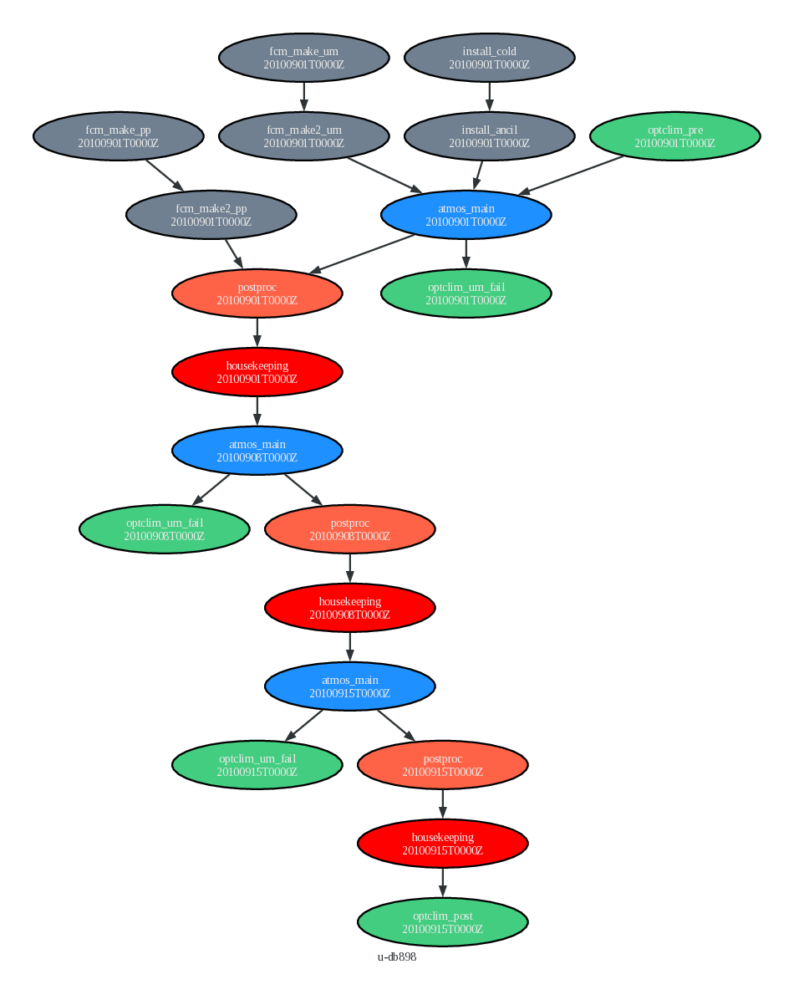

# Cylc Rose configuration to run UM on Archer2

UM runs on Archer2 is managed with the Cylc workflow manager from `puma2`.
The following tasks can be added to run a Cylc suite from OptClim:

 * `optclim_pre` runs before the first `atmos_main` task.
 * `optclim_post` runs after the last `atmos_main` task.
 * `optclim_um_fail` runs if any `atmos_main` task fails.

## Controling Cylc suites with OptClim

The content of this directory needs to be merged with the suite and
the following line needs to be appended to `suite.rc`:
```
%include optclim.rc
```

## Example

These tasks are added to [u-db898](../../../configurations/example_UM_rose/references/u-db898), where
the simulation duration and resubmit duration is controlled by  `EXPT_RUNLEN` and `EXPT_RESUB`
defined in `rose-suite.conf`.
The following values will run the UM for 21 days in 3 steps:
```
EXPT_RESUB='P7D'
EXPT_RUNLEN='P0Y0M21D'
```
The resulting graph is:


## Development

### Update the suite

Edit `suite.rc`, then run `rose suite-run -l` to update the run directory in `~/cylc-run/udb898`. 
Visualise the graph with `cylc graph ~/cylc-run/u-db898/suite.rc`. 
Click 'Ungroup' in the toolbar at the top to see the workflow graph.

### Add tasks

Each task is in `app/<task_name>`.
An individual task can be tested, outside of running a suite, with `rose app-run <path_to_task>`
See Rose documentation for more details.

## Resources

 * Cylc 7.8 [documentation](https://cylc.github.io/cylc-doc/7.8.8/html/index.html)
